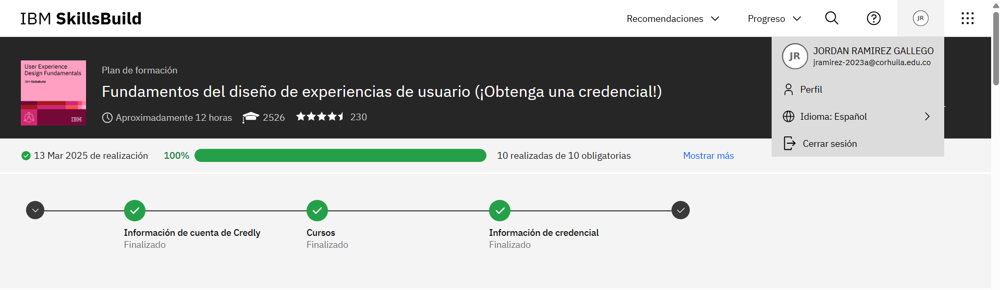
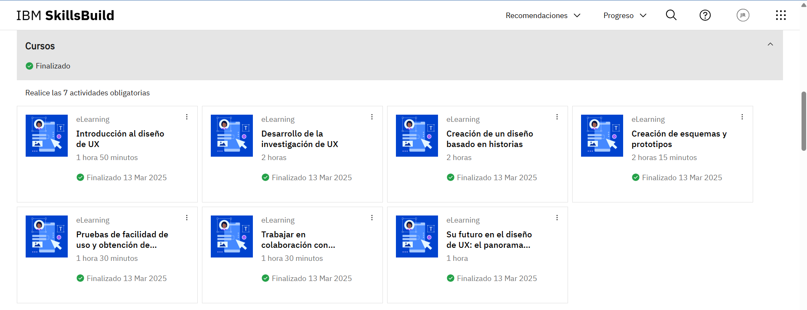
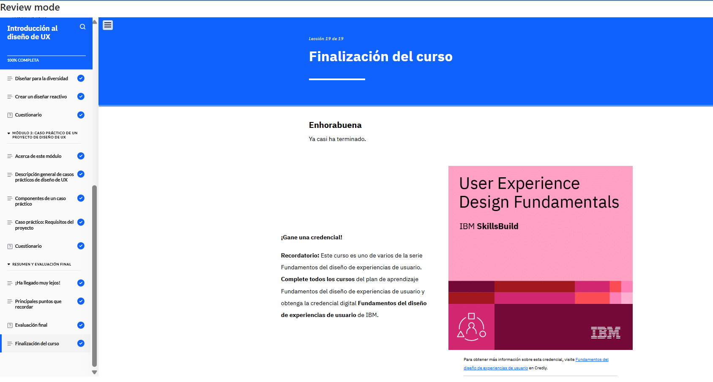
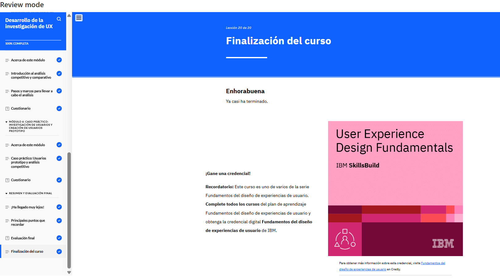
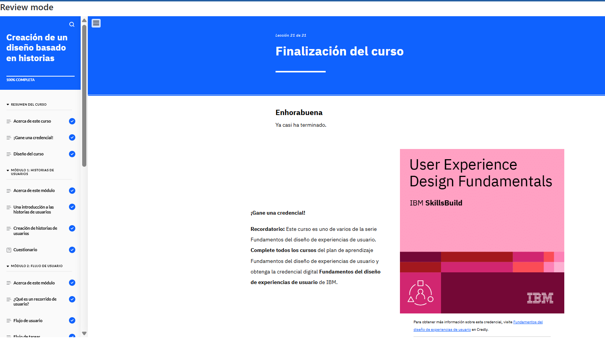

# Fundamentos del diseño de experiencias de usuario (¡Obtenga una credencial!)

## plan de formación

## Cursos

## Módulos

### 01. Introducción al diseño de UX

#### Este módulo proporciona una visión general del diseño, cubriendo los conceptos básicos de experiencias de usuarios (UX). Se aprendió sobre como aplicar estos conceptos en proyectos reales.

### 02. Desarrollo de la investigación de UX

#### Este curso te enseñará por qué la investigación es clave para diseñar experiencias centradas en el usuario. Aprenderás distintos métodos y técnicas de UX, cómo crear usuarios prototipo basados en datos reales y la importancia de analizar a la competencia para mejorar un producto. Además, explorarás un caso práctico donde se aplicaron estos conceptos en un proyecto real.

### 03. Creación de un diseño basado en historias

#### En este curso, aprenderás cómo las historias de usuario ayudan a entender mejor a los usuarios y a diseñar soluciones efectivas, explorando un caso práctico en un sitio web de venta de plantas.