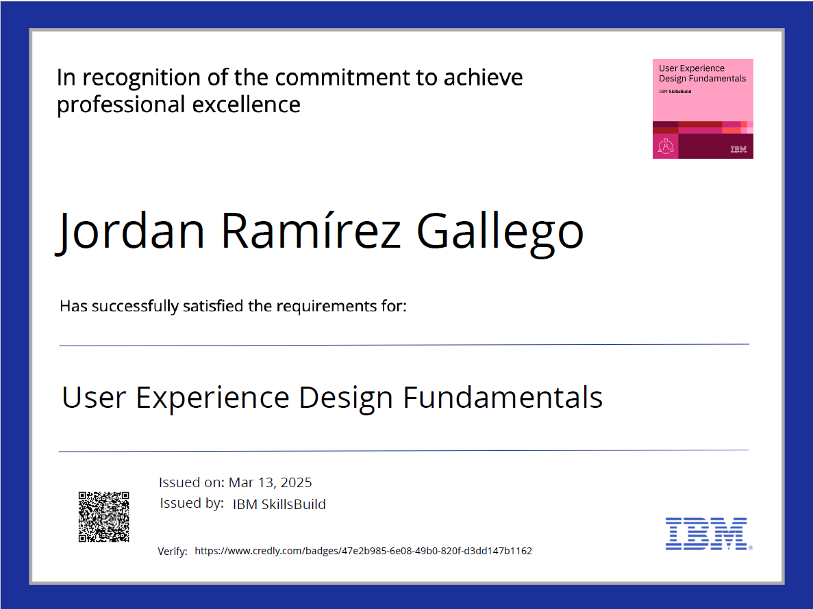
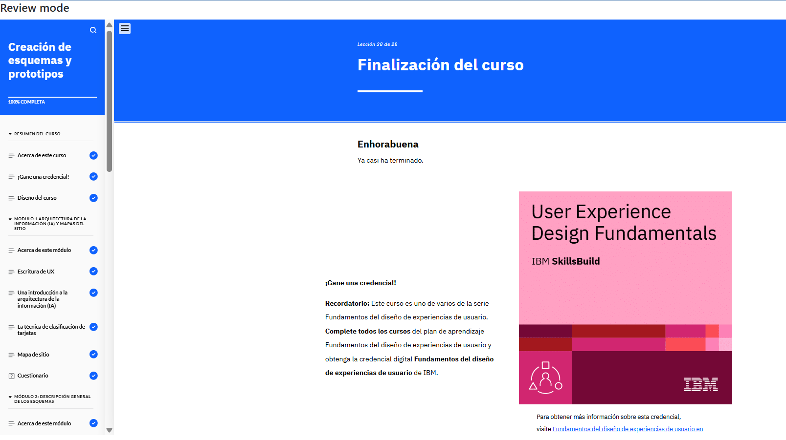
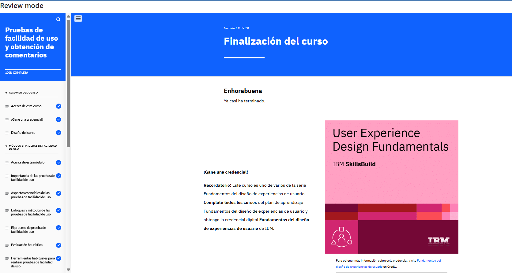
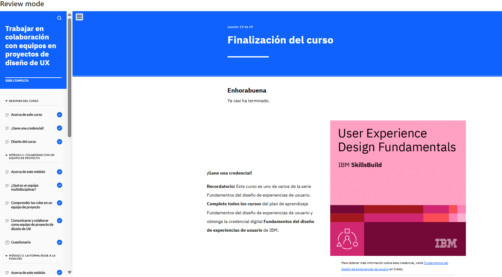

# Fundamentos del diseño de experiencias de usuario (¡Obtenga una credencial!)

## plan de formación

## Cursos

## Certificado

## Módulos

### 01. Introducción al diseño de UX

#### Este módulo proporciona una visión general del diseño, cubriendo los conceptos básicos de experiencias de usuarios (UX). Se aprendió sobre como aplicar estos conceptos en proyectos reales.

### 02. Desarrollo de la investigación de UX

#### Este curso te enseñará por qué la investigación es clave para diseñar experiencias centradas en el usuario. Aprenderás distintos métodos y técnicas de UX, cómo crear usuarios prototipo basados en datos reales y la importancia de analizar a la competencia para mejorar un producto. Además, explorarás un caso práctico donde se aplicaron estos conceptos en un proyecto real.

### 03. Creación de un diseño basado en historias

#### En este curso, aprenderás cómo las historias de usuario ayudan a entender mejor a los usuarios y a diseñar soluciones efectivas, explorando un caso práctico en un sitio web de venta de plantas.

### 04. Creación de esquemas y prototipos

#### En este curso, explorarás la escritura de UX, la arquitectura de la información y los mapas de sitio. Aprenderás sobre esquemas, prototipos y principios de UI para mejorar la accesibilidad. Finalmente, analizarás un caso práctico en un e-commerce de plantas.

### 05. Pruebas de facilidad de uso y obtención de comentarios

#### En este curso, aprenderás cómo los diseñadores de UX evalúan sus diseños con pruebas de facilidad de uso. Descubrirás métodos, pasos y cómo priorizan la información obtenida. También verás cómo los comentarios mejoran los diseños y analizarás un caso práctico en un e-commerce de plantas.

### 06. Trabajar en colaboración con equipos en proyectos de diseño de UX

#### En este curso, aprenderás sobre la importancia de la colaboración en equipos multidisciplinarios en el diseño de UX. Descubrirás roles clave, buenas prácticas para trabajar juntos y cómo se realiza el traspaso del diseño al desarrollo. También analizarás un caso práctico en un e-commerce de plantas. 