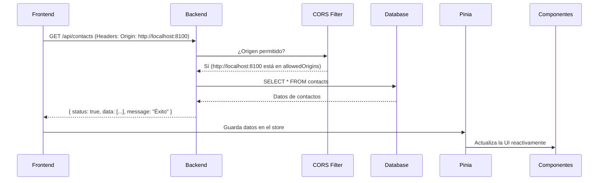

### **Explicación Detallada de la Conexión Backend-Frontend**

La conexión entre el **backend (Spring Boot)** y el **frontend (Ionic/Vue)** se establece mediante una **API REST** que sigue un flujo estructurado, garantizando seguridad, consistencia y eficiencia. A continuación, se detallan los componentes clave y su interacción:

---

## **1. Configuración CORS en el Backend (`AppConfig.java`)**

El **Cross-Origin Resource Sharing (CORS)** es un mecanismo de seguridad que controla qué dominios externos pueden acceder a los recursos del backend. En tu configuración:

```java
@Bean
public CorsConfigurationSource corsConfigurationSource() {
    CorsConfiguration config = new CorsConfiguration();
    config.setAllowedOrigins(Arrays.asList(
        "http://localhost:8100", // Frontend Ionic en desarrollo
        "capacitor://localhost", // Para apps móviles Ionic
        "http://localhost"       // Emuladores
    ));
    config.setAllowedMethods(Arrays.asList("GET", "POST", "PUT", "DELETE", "OPTIONS")); // Métodos HTTP permitidos
    config.setAllowedHeaders(Arrays.asList("Content-Type", "Authorization", "X-Requested-With", "Accept")); // Headers permitidos
    config.setAllowCredentials(true); // Permite cookies/tokens de autenticación
    config.setMaxAge(3600L); // Cachea la configuración CORS por 1 hora

    UrlBasedCorsConfigurationSource source = new UrlBasedCorsConfigurationSource();
    source.registerCorsConfiguration("/**", config); // Aplica a todas las rutas
    return source;
}
```

### **¿Por qué es importante?**

- **Seguridad**: Restringe el acceso solo a los orígenes permitidos (evita ataques CSRF).
- **Flexibilidad**: Permite que el frontend (Ionic) se comunique con el backend sin bloqueos del navegador.
- **Credenciales**: `setAllowCredentials(true)` habilita el envío de cookies/tokens (útil para autenticación).

---

## **2. Estructura de Respuestas (`ApiResponseDto`)**

El backend usa `ApiResponseDto` para estandarizar las respuestas enviadas al frontend:

```java
public class ApiResponseDto<T> {
    private Boolean status;  // Indica éxito (true) o error (false)
    private T data;         // Datos de la respuesta (ej: lista de contactos)
    private String message; // Mensaje descriptivo (ej: "Contacto creado")
    // Getters y Setters...
}
```

### **Ejemplo de Uso en un Controlador**

```java
@GetMapping("/contacts")
public ResponseEntity<ApiResponseDto<List<Contact>>> getAllContacts() {
    List<Contact> contacts = contactService.findAll();
    return ResponseEntity.ok(
        new ApiResponseDto<>("Contactos obtenidos", contacts, true)
    );
}
```

### **Ventajas**

- **Consistencia**: Todas las respuestas siguen el mismo formato (`{ status, data, message }`).
- **Tipado fuerte**: El frontend (TypeScript) puede mapear fácilmente los datos.
- **Manejo de errores**: Si `status = false`, el frontend sabe que hubo un error y muestra `message`.

---

## **3. Flujo de Comunicación Completo**

### **Paso a Paso: Cómo se Conectan Frontend y Backend**

1. **Frontend (Ionic/Vue) realiza una petición**

   - Ejemplo: Obtener todos los contactos (`GET /api/contacts`).
   - Uso de **Axios** en el servicio:
     ```typescript
     async fetchContacts() {
         const response = await api.get<ApiResponse<Contact[]>>("/contacts");
         return response.data; // { status: true, data: [...], message: "..." }
     }
     ```

2. **Backend (Spring Boot) recibe la solicitud**

   - El **CORS Filter** verifica que el origen (`http://localhost:8100`) esté permitido.
   - El **Controller** procesa la petición y delega al **Service**.
   - El **Service** consulta la base de datos y estructura la respuesta con `ApiResponseDto`.

3. **Frontend recibe y maneja la respuesta**
   - Si `status = true`, actualiza el estado en **Pinia**:
     ```typescript
     // En el store (Pinia)
     this.contacts = response.data; // Datos de contactos
     ```
   - Si `status = false`, muestra un error:
     ```vue
     <template v-if="error">
       <p>{{ error.message }}</p>
     </template>
     ```

---

## **4. Ejemplo Práctico: Crear un Contacto**

### **Backend (Spring Boot)**

```java
@PostMapping("/contacts")
public ResponseEntity<ApiResponseDto<Contact>> createContact(@RequestBody ContactDto request) {
    Contact newContact = contactService.save(request);
    return ResponseEntity.ok(
        new ApiResponseDto<>("Contacto creado", newContact, true)
    );
}
```

### **Frontend (Ionic/Vue)**

```typescript
// En el servicio
async createContact(contact: Contact) {
    const response = await api.post<ApiResponse<Contact>>("/contacts", contact);
    return response.data; // { status: true, data: {...}, message: "Contacto creado" }
}

// En el componente
const onSubmit = async () => {
    try {
        await store.saveContact(newContact);
        router.push("/"); // Redirige a la lista
    } catch (error) {
        alert("Error al crear contacto");
    }
};
```

---

## **5. Diagrama de Secuencia**



---

### **Conclusión**

- **CORS** asegura que solo tu frontend pueda acceder al backend.
- **ApiResponseDto** estandariza las respuestas para un manejo fácil en el frontend.
- **Axios + Pinia** gestionan las peticiones y el estado de forma reactiva.
- **TypeScript/Java** mantienen consistencia en los tipos de datos.

**¿Quieres profundizar en cómo se manejan los errores HTTP (404, 500) o la integración con JWT para autenticación?**
