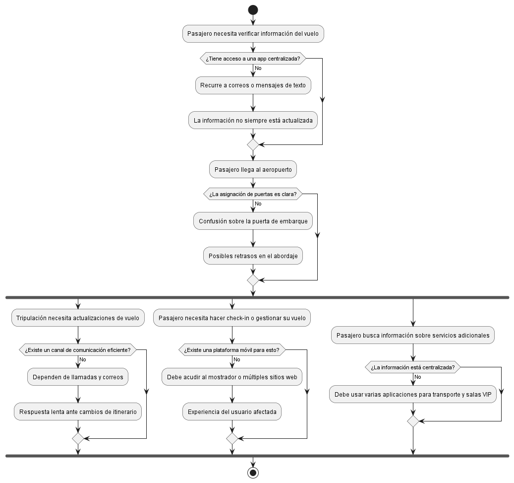

# Explicación del Diagrama de la Problemática

El diagrama representa la problemática en la gestión y control de vuelos en tres áreas principales: **pasajeros, tripulación y servicios adicionales**.

## 1. Pasajeros
- No tienen acceso centralizado a la información del vuelo.
- Dependen de correos o mensajes desactualizados.
- Confusión en la asignación de puertas y retrasos en el embarque.
- Falta de una plataforma eficiente para check-in y gestión del itinerario.

## 2. Tripulación
- No cuentan con un canal de comunicación eficiente con el personal de tierra.
- La respuesta ante cambios de itinerario y asignaciones es lenta.
- Se depende de llamadas y correos electrónicos para coordinar tareas.

## 3. Servicios adicionales
- No hay integración con transporte, salas VIP y controles de seguridad.
- Los pasajeros deben usar múltiples aplicaciones para obtener información.

El diagrama destaca la necesidad de una **solución móvil centralizada** que optimice la comunicación y mejore la experiencia del usuario.

