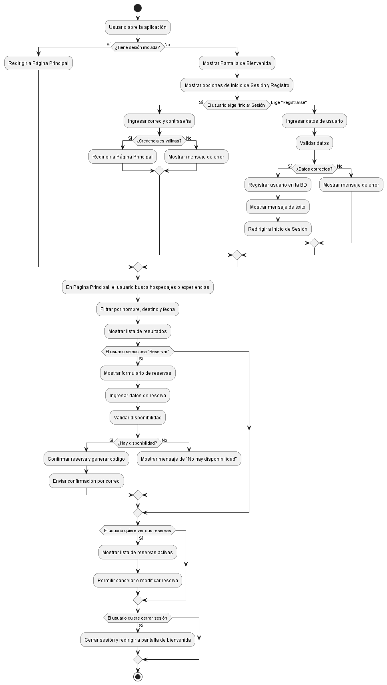
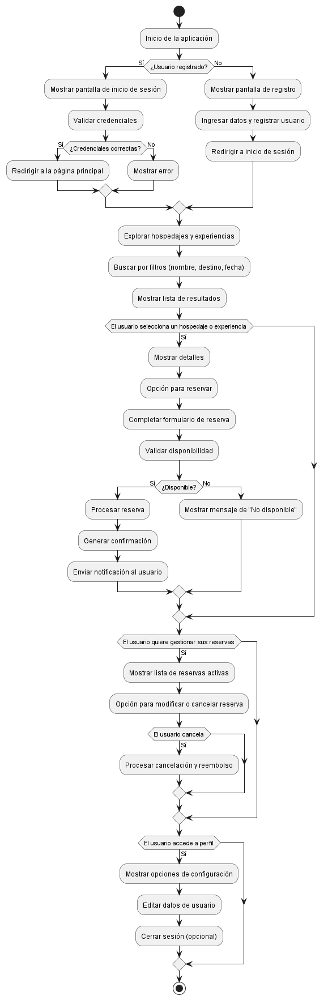

# **HU_01 - Análisis y Definición del Proyecto**

## **Descripción:**

La empresa _Explora Neiva_ actualmente gestiona sus actividades de turismo y reservas de manera manual, lo que genera problemas de **desorganización, pérdida de tiempo y dificultad en la administración de pagos y reservas**. Se requiere un análisis detallado del negocio para **identificar las ineficiencias del sistema actual** y definir los **beneficios esperados con la digitalización**.

A partir de este análisis, se definirá el **alcance, objetivos y funcionalidades clave del proyecto**, asegurando que los **módulos principales** de la aplicación respondan a las necesidades del negocio y mejoren la experiencia del usuario. También se evaluará el uso de **conexión a internet** y la viabilidad de futuras integraciones, como **realidad aumentada**.

Además, se realizará una representación visual del sistema a través de diagramas que permitan comprender el flujo de información y las interacciones clave dentro de la plataforma.

---

## **Criterios de Aceptación:**

✔ Se identifican las problemáticas operativas actuales.  
✔ Se establecen las necesidades y beneficios clave de la digitalización.  
✔ Se definen los módulos principales de la aplicación con sus funcionalidades clave.  
✔ Se evalúa la conectividad y la posibilidad de integrar realidad aumentada en el futuro.  
✔ Se generan diagramas para modelar el funcionamiento del sistema.

---

## **Task (Distribución por integrante - Sin Documentación Formal)**

### **1️⃣ Investigación del negocio y problemáticas actuales (Integrante 1)**

- Analizar la información obtenida en la entrevista previa.
- Identificar puntos de ineficiencia en el proceso manual actual.
- Compartir hallazgos con el equipo para la toma de decisiones.

### **2️⃣ Definición del alcance y objetivos del proyecto (Integrante 2)**

- Establecer **objetivos SMART** basados en los hallazgos del análisis.
- Definir las necesidades prioritarias del negocio.
- Asegurar que el alcance sea realista dentro del tiempo disponible.

### **3️⃣ Identificación y diseño de módulos principales (Integrante 3)**

- Proponer los **módulos esenciales** de la aplicación (_ej. Reservas, Pagos, Gestión de Tours_).
- Definir funcionalidades clave de cada módulo sin necesidad de documentación extensa.
- Validar con el equipo si los módulos cubren las necesidades detectadas.

### **4️⃣ Evaluación de conectividad y tecnologías futuras (Integrante 4)**

- Analizar si la aplicación necesita **conexión constante a internet**.
- Evaluar la viabilidad de **integrar realidad aumentada** en el futuro.
- Proponer herramientas o tecnologías que podrían implementarse más adelante.

---

## **Modelado del Sistema**

Para complementar el análisis, se presentan diagramas clave que permitirán visualizar mejor la estructura y operación del sistema.

### **1️⃣ Diagrama de Flujo**

Este diagrama representa el proceso detallado de reserva de experiencias en la aplicación, mostrando los pasos y decisiones involucradas.

#### **Explicación:**

- **Inicio:** El turista accede a la aplicación y explora las experiencias disponibles.
- **Selección de Experiencia:** El usuario elige una actividad y revisa los detalles.
- **Verificación de Disponibilidad:** Se consulta la disponibilidad de fechas y cupos.
- **Confirmación de Reserva:** Si hay disponibilidad, el usuario procede con la reserva.
- **Pago:** Se ofrece la opción de pago con tarjeta o transferencia.
- **Finalización:** Si el pago es exitoso, se confirma la reserva y se genera un comprobante.

---

### **2️⃣ Diagrama de Procesos**

Este diagrama ilustra el flujo de actividades clave dentro del sistema.

#### **Explicación:**

El diagrama muestra la secuencia de pasos desde la exploración de sitios hasta la confirmación de una reserva y su pago. Se detallan los siguientes procesos:

1. **Exploración de sitios turísticos** mediante QR o búsqueda manual.
2. **Selección de una experiencia** disponible en la plataforma.
3. **Reserva de la experiencia**, sujeta a disponibilidad.
4. **Realización del pago**, confirmando la reserva.
5. **Generación de notificaciones** al usuario sobre su estado.

---

### **3️⃣ Construcción del Modelo Relacional (MR)**

Se presenta la estructura de la base de datos, con sus entidades y relaciones.

#### **Explicación:**

La base de datos está conformada por las siguientes entidades:

- **Usuario:** Contiene información de los turistas, anfitriones y administradores.
- **Sitio Turístico:** Representa lugares con información vinculada a códigos QR.
- **QR Code:** Almacena códigos asociados a sitios turísticos.
- **Experiencia:** Representa actividades ofrecidas por anfitriones.
- **Reserva:** Registra las experiencias reservadas por los turistas.
- **Pago:** Maneja los métodos de pago y estados de transacción.
- **Notificación:** Informa a los usuarios sobre eventos importantes.
- **Valoración:** Permite que los turistas califiquen las experiencias vividas.

Se han definido relaciones entre las entidades para garantizar la integridad de los datos.

---

## **Para Trello:**

📌 **Lista:** "Backlog" o "Sprint Actual" (según dónde la coloquen)  
📌 **Tarjeta:** "Análisis y Definición del Proyecto"  
📌 **Checklist con las tareas asignadas** (Cada integrante marca su avance)  
📌 **Comentarios en la tarjeta para actualizar avances** en lugar de documentación formal  
📌 **Etiquetas de color** (Ej: _Análisis, Definición, Diseño, Tecnología_)  
📌 **Fecha estimada de cierre alineada con el sprint**

---

## **Conclusión:**

El análisis inicial ha permitido establecer los requisitos fundamentales del sistema y su estructura de datos. La combinación de diagramas de **casos de uso, procesos y modelo relacional** permite visualizar de manera integral la funcionalidad del sistema. Estos modelos servirán como base para la implementación en la siguiente fase del desarrollo.
