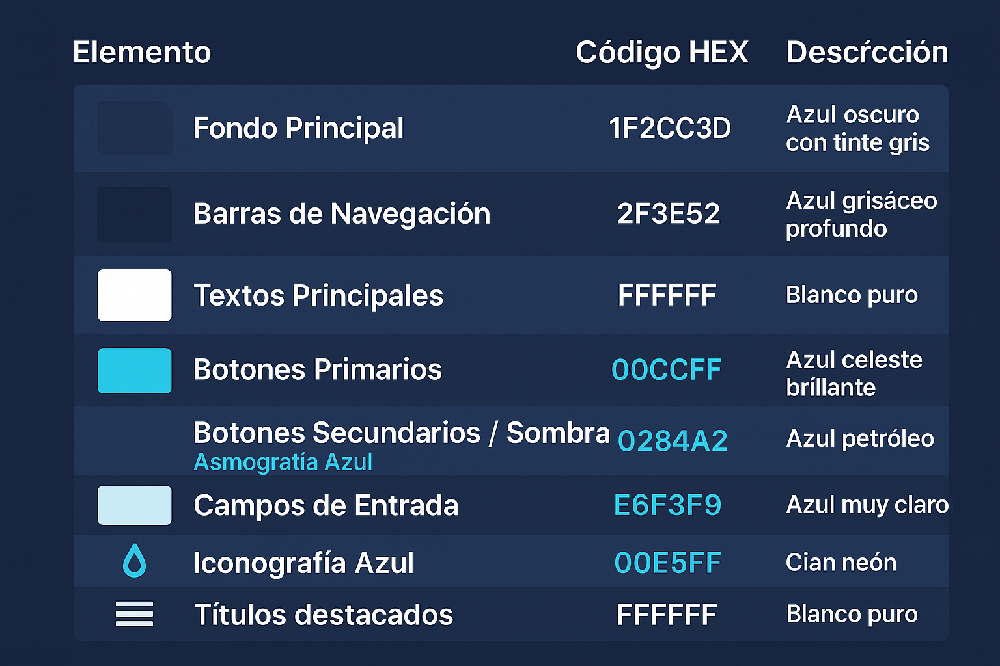

# **HU_02 - Definición del Diseño y Estilos de la Aplicación**

## **Descripción:**

Como equipo de desarrollo, necesitamos establecer la identidad visual de la aplicación de _Explora Neiva_, definiendo los **colores, tipografía, botones y otros elementos de diseño** para garantizar una experiencia de usuario atractiva y coherente con la marca. Además, se deben definir los **mensajes de notificación** para proporcionar retroalimentación clara sobre las acciones realizadas.

## **Criterios de Aceptación:**

✔ Se define una **paleta de colores** principal y secundaria basada en la identidad visual de _Explora Neiva_.  
✔ Se elige la **tipografía** para títulos, subtítulos y textos generales, asegurando legibilidad.  
✔ Se diseñan los **estilos de botones, barras de navegación y otros componentes interactivos**.  
✔ Se establecen los **mensajes de notificación** para acciones clave (_éxito, error, advertencia, información_).  
✔ Se crea una **guía visual** con ejemplos de los elementos definidos.  
✔ Se valida que el diseño sea **accesible y fácil de usar en dispositivos móviles y web**.

---

## **Paleta de Colores Seleccionada**

| **Elemento**                 | **Código HEX** | **Descripción**            |
| ---------------------------- | -------------- | -------------------------- |
| Fondo Principal              | `#1F2C3D`      | Azul oscuro con tinte gris |
| Barras de Navegación         | `#2F3E52`      | Azul grisáceo profundo     |
| Textos Principales           | `#FFFFFF`      | Blanco puro                |
| Botones Primarios            | `#00CFFF`      | Azul celeste brillante     |
| Botones Secundarios / Sombra | `#0284A2`      | Azul petróleo              |
| Campos de Entrada            | `#E6F3F9`      | Azul muy claro             |
| Iconografía Azul             | `#00E5FF`      | Cian Neón                  |
| Títulos destacados           | `#FFFFFF`      | Blanco puro                |

---

## **Task (Distribución por integrante - Fase de Diseño con Notificaciones)**

### **1️⃣ Definición de la paleta de colores y validación de accesibilidad (Integrante 1)**

- Implementar la **paleta de colores** en el diseño base de la aplicación.
- Asegurar que los colores sean **accesibles** y tengan buen contraste.
- Definir el uso de cada color en los elementos de la interfaz.

### **2️⃣ Selección de tipografía y tamaños de texto (Integrante 2)**

- Elegir una fuente adecuada para **títulos, subtítulos y textos generales**.
- Establecer **tamaños y pesos** adecuados para una mejor jerarquía visual.
- Probar la **legibilidad** en diferentes resoluciones y dispositivos.

### **3️⃣ Diseño de botones, barras de navegación y mensajes de notificación (Integrante 3)**

- Definir los **estilos de botones** (_colores, bordes, sombras, estados hover/active_).
- Diseñar **barras de navegación** y otros elementos interactivos.
- Establecer mensajes de notificación estándar para diferentes tipos de acción:
  - ✅ **Éxito**: Acción completada con éxito. (`#0F969C`)
  - ⚠ **Advertencia**: Algo requiere atención del usuario. (`#6DA5C0`)
  - ❌ **Error**: Ocurrió un problema con la acción. (`#294D61`)
  - ℹ **Información**: Mensajes que guían al usuario. (`#C7C7C5`)

### **4️⃣ Creación de la guía visual y validación final (Integrante 4)**

- Unificar los elementos diseñados en una **mini guía visual**.
- Presentar **ejemplos de uso** con capturas o prototipos rápidos.
- Revisar y validar con el equipo para realizar **ajustes finales**.

---

## **Para Trello:**

📌 **Lista:** "Sprint Actual" (o "Diseño UI")  
📌 **Tarjeta:** "Definición del Diseño, Botones y Notificaciones"  
📌 **Checklist con tareas asignadas**  
📌 **Etiquetas:** _Diseño, UI/UX, Accesibilidad, Notificaciones_  
📌 **Fecha estimada de cierre alineada con el sprint**
