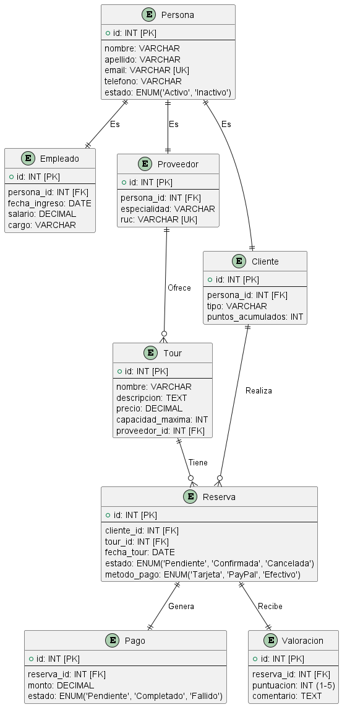
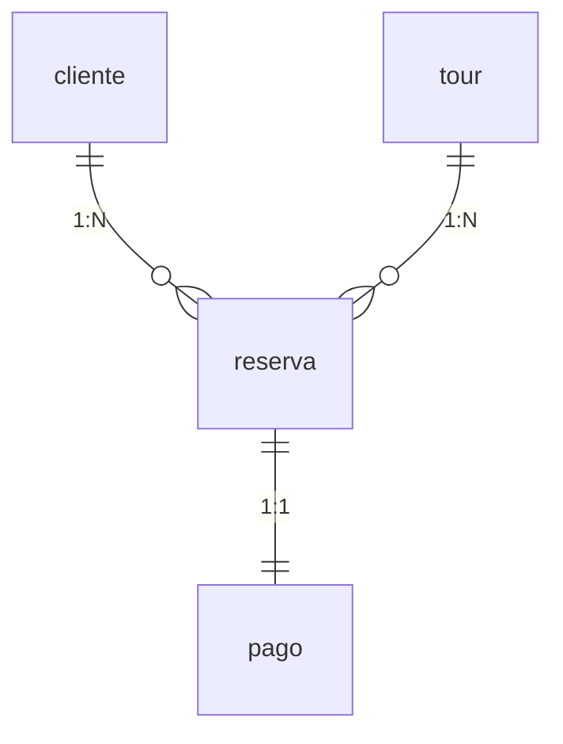
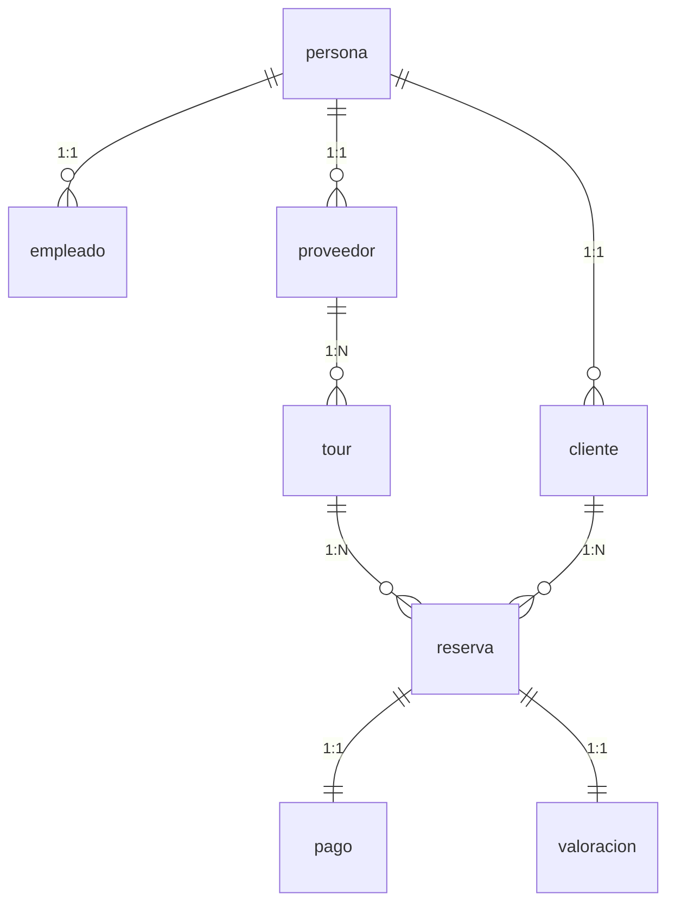

# **Documentación Técnica - Modelo de Datos para Sistema de Turismo**

## **1. Estructura Central: Tabla `persona`**

**Función:**  
Base fundamental que centraliza la información común de todos los actores del sistema (empleados, clientes y proveedores), evitando duplicación de datos.

**Diagrama:**  


**Características Clave:**

- Campos esenciales: nombre, apellido, email (único), teléfono
- Estado activo/inactivo para control de acceso
- Auditoría automática con `fecha_creacion` y `fecha_actualizacion`

**Uso Típico:**

```sql
-- Registrar nueva persona
INSERT INTO persona (nombre, apellido, email)
VALUES ('Ana', 'Rodríguez', 'ana@exploraneiva.com');
```

**Ejemplo Práctico:**  
Un guía turístico registrado como `persona` (ID: 5) puede posteriormente convertirse en `cliente` para reservar tours.

---

## **2. Tablas Especializadas por Rol**

### **2.1 Tabla `empleado`**

**Función:**  
Gestiona información laboral del equipo de _Explora Neiva_.

**Datos Críticos:**

- Fecha de ingreso (para cálculo de antigüedad)
- Salario con validación (`CHECK > 0`)
- Cargo predeterminado como 'Guía turístico'

**Ejemplo de Registro:**

```sql
-- Asignar rol de empleado
INSERT INTO empleado (persona_id, fecha_ingreso, salario)
VALUES (5, '2025-01-10', 2800000);
```

### **2.2 Tabla `proveedor`**

**Función:**  
Administra partners comerciales que ofrecen servicios turísticos.

**Características Especiales:**

- RUC único para identificación fiscal
- Sistema de calificación (0-5) para evaluar calidad
- Especialidad para búsquedas segmentadas

**Caso de Uso:**  
Proveedor "EcoAventuras" (persona_id: 8) con especialidad en trekking y calificación 4.8.

### **2.3 Tabla `cliente`**

**Función:**  
Almacena preferencias y datos específicos de turistas.

**Funcionalidades:**

- Clasificación por tipo (Ocasional/Frecuente/VIP)
- Sistema de puntos para fidelización
- Preferencias para recomendaciones personalizadas

**Ejemplo:**  
Cliente VIP (persona_id: 12) con 1,500 puntos acumulados y preferencia por tours gastronómicos.

---

## **3. Tablas de Operaciones Comerciales**

### **3.1 Tabla `tour`**

**Función:**  
Catálogo completo de experiencias turísticas ofrecidas.

**Diseño Optimizado:**

- Precio con validación positiva
- Capacidad máxima para control de disponibilidad
- Índice FULLTEXT para búsquedas por nombre/descripción
- Relación opcional con proveedor (pueden ser tours propios)

**Consulta Ejemplo:**

```sql
-- Buscar tours de aventura
SELECT * FROM tour
WHERE MATCH(nombre, descripcion) AGAINST('aventura')
AND activo = TRUE;
```

### **3.2 Tabla `reserva`**

**Función:**  
Corazón del sistema de reservaciones con seguimiento de estados.

**Flujo de Estados:**

1. `PENDIENTE`: Recién creada
2. `CONFIRMADA`: Con pago validado
3. `CANCELADA`: Por cliente o sistema
4. `COMPLETADA`: Tras finalizar el tour

**Relaciones Clave:**



---

## **4. Módulos Complementarios**

### **4.1 Tabla `pago`**

**Función:**  
Rastreo completo de transacciones financieras.

**Estados Implementados:**

- `REEMBOLSADO`: Para devoluciones
- `RECHAZADO`: Pagos fallidos
- Registro de método y comprobante

### **4.2 Tabla `valoracion`**

**Función:**  
Sistema de reseñas para mejora continua.

**Restricciones:**

- Puntuación obligatoria (1-5 estrellas)
- Comentario opcional
- Relación 1:1 con reserva (evita duplicados)

---

## **5. Procedimientos Almacenados Clave**

### **5.1 `sp_crear_reserva`**

**Lógica de Negocio:**

1. Verifica disponibilidad del tour
2. Valida capacidad vs. personas solicitadas
3. Registra la reserva o devuelve error

### **5.2 `sp_registrar_pago`**

**Flujo Crítico:**

- Rechaza pagos para reservas canceladas
- Actualiza automáticamente estado de reserva
- Registra método de pago

---

## **Diagrama de Relaciones Completo**



---

## **Conclusión**

Este modelo resuelve los requerimientos de _Explora Neiva_ mediante:

- **Centralización** de datos en `persona`
- **Especialización** por roles
- **Traza completa** del flujo reserva-pago-valoración
- **Escalabilidad** para futuros módulos (ej: promociones, inventario)

**Próximos Pasos:**

1. Implementar API REST para integración móvil
2. Desarrollar panel de administración
3. Crear vistas para reportes analíticos
