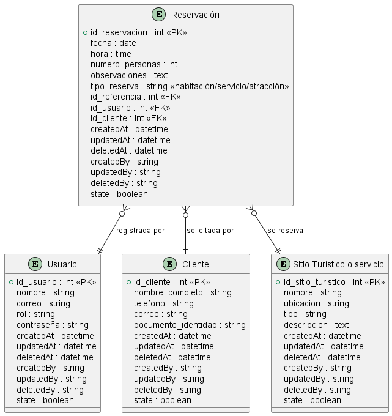

# Documentación Técnica - Modelo de Datos  
## Sistema de Reservas de Sitios Turísticos  
### Basado en la HU_05 – Implementación de Entidades en la Aplicación Móvil

---

## Descripción General

Esta documentación técnica describe el **modelo de datos lógico** implementado para el sistema de reservas de sitios turísticos, como parte del refinamiento de la historia de usuario HU_05.  

El propósito es establecer una **estructura de entidades** coherente, normalizada y escalable, para ser utilizada en la capa de datos de la aplicación móvil.  

---

**Diagrama:**  

---

## Entidades del Sistema

A continuación, se presentan las entidades principales del sistema, con sus respectivos atributos, claves primarias y relaciones.

---

### 1. Usuario

> Representa al personal autorizado que opera la aplicación móvil (Administrador o Empleado).

**Atributos:**
- `id_usuario` (PK)
- `nombre`
- `correo`
- `rol` (Administrador / Empleado)
- `contraseña`
- `createdAt`
- `updatedAt`
- `deletedAt`
- `createdBy`
- `updatedBy`
- `deletedBy`
- `state`

---

### 2. Cliente

> Persona que solicita una reservación a través de canales externos como WhatsApp, llamadas o redes sociales.

**Atributos:**
- `id_cliente` (PK)
- `nombre_completo`
- `telefono`
- `correo`
- `documento_identidad`
- `createdAt`
- `updatedAt`
- `deletedAt`
- `createdBy`
- `updatedBy`
- `deletedBy`
- `state`

---

### 3. Reservación

> Solicitud de reserva generada manualmente por un usuario autorizado.

**Atributos:**
- `id_reservacion` (PK)
- `fecha`
- `hora`
- `numero_personas`
- `precio`
- `observaciones`
- `id_usuario` (FK)
- `id_cliente` (FK)
- `id_sitio_turistico` (FK)
- `createdAt`
- `updatedAt`
- `deletedAt`
- `createdBy`
- `updatedBy`
- `deletedBy`
- `state`

---

### 4. servicio

> Lugar general que ofrece reservaciones: puede ser un hotel, atracción o parque.

**Atributos:**
- `id_servicio` (PK)
- `nombre`
- `ubicacion`
- `tipo` (Hotel / Servicio / Atracción)
- `descripcion`
- `createdAt`
- `updatedAt`
- `deletedAt`
- `createdBy`
- `updatedBy`
- `deletedBy`
- `state`

---

## Relaciones entre Entidades

- Un **Usuario** puede registrar muchas **Reservaciones**.
- Un **Cliente** puede tener muchas **Reservaciones**.
- Una **Reservación** está asociada a un **Servicio**.

---

## Reglas y Restricciones

- Solo **Usuarios Autorizados** (empleados o administradores) pueden acceder a estas entidades.
- No se incluye interacción directa con clientes finales.
- No se utilizan **códigos QR** ni escaneo en esta fase.
- Se deben respetar principios de **integridad referencial**, **normalización** y **auditoría**.
- Se excluyen vistas gráficas o lógica de cliente.

---

## Campos de Auditoría Comunes

Las entidades implementan los siguientes campos de auditoría:

- `createdAt`: Fecha de creación  
- `updatedAt`: Fecha de última modificación  
- `deletedAt`: Fecha de eliminación lógica  
- `createdBy`: Usuario que creó  
- `updatedBy`: Usuario que modificó  
- `deletedBy`: Usuario que eliminó  
- `state`: Estado del registro (activo/inactivo)

---

## Consideraciones Técnicas

- Implementar clases o modelos en la capa lógica móvil.
- Validaciones de campos requeridos (por tipo y formato).
- Conexión con backend o almacenamiento local/remoto.
- Soporte CRUD completo por cada entidad.
- Separación clara entre entidades abstractas y específicas.
- Posible uso de herencia o interfaces según el framework.

---

## Entradas Esperadas

- Datos de usuario (nombre, rol, correo, contraseña).
- Datos del cliente (nombre, documento, contacto).
- Información de reserva (fecha, hora, personas).
- Detalles del sitio turístico (nombre, tipo, ubicación).
- Elemento reservable según el tipo de sitio.

---

## Salidas Esperadas

- Base de datos funcional con entidades creadas.
- API o servicios disponibles para CRUD.
- Visualización estructurada de información para el personal.
- Preparación para futuras integraciones.

---

## Conclusión

Este modelo de datos establece la estructura base que soporta la gestión de reservas del sistema. Permite un registro claro, organizado y seguro por parte del personal autorizado, con alta capacidad de escalabilidad y mantenimiento.

No contempla visualización del cliente, códigos QR, ni componentes visuales, siendo el primer paso en la consolidación de un sistema robusto para la gestión turística móvil.

---
